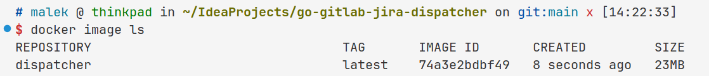

# Go GitLab Jira Dispatcher

## TODO

- [ ] Make SQLite store for webhooks, their transitions, and their allowed project keys
- [ ] Add stateless login system (jwt) with hashed password
    - [ ] Add cli for user creation

## Requirements

* In order to get any assignments working, any actors in the Merge Request need to set their Mail to public 

## Package size
